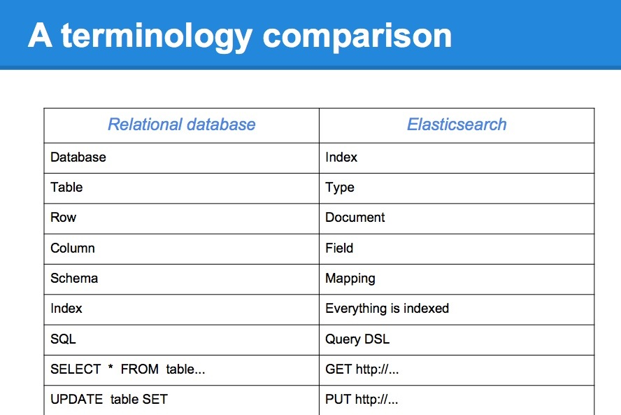

## Lucene

Elasticsearch使用Lucene作为其底层的搜索引擎，关于Lucene的介绍，可以参考[官方网站](http://lucene.apache.org)。

Lucene关键概念：

+ Document：用来索引和搜索的主要数据源，包含一个或者多个Field，而这些Field则包含我们跟Lucene交互的数据。
+ Field：Document的一个组成部分，有两个部分组成，name和value。
+ Term：不可分割的词语，搜索里面最小单元。
+ Token：一个Term呈现方式，包含这个Term的文字，在文档中的起始位置，以及类型。

Lucene使用[Inverted index](http://en.wikipedia.org/wiki/Inverted_index)来存储term在document中位置的映射关系。
譬如如下文档：

- Elasticsearch Server 1.0 （document 1）
- Mastring Elasticsearch （document 2）
- Apache Solr 4 Cookbook （document 3）

使用inverted index存储，一个简单地映射关系：

|Term|Count|Docuemnt|
|----|-----|--------|
|1.0|1|\<1\>|
|4|1|\<3\>|
|Apache|1|\<3\>|
|Cookbook|1|\<3\>|
|Elasticsearch|2|\<1\>.\<2\>|
|Mastering|1|\<2\>|
|Server|1|\<1\>|
|Solr|1|\<3\>|

在上面的例子中，我们首先对文档进行切分，数据会采用默认策略依照空格分割成一个一个term，然后映射index中该term总的出现次数以及在哪个document里面。

## Input data analysis

Document里面的数据如何生成inverted index？查询语句如何切分成terms并允许搜索？相关的东西我们叫做[Analysis](https://www.elastic.co/guide/en/elasticsearch/reference/2.3/analysis.html)。

Analysis通过[Analyzer](https://www.elastic.co/guide/en/elasticsearch/reference/2.3/analysis-analyzers.html)实现。

* analyzer分为index time analyzer和search time analyzer

* analyzer由一个[Tokenizer]()以及零或者多个[TokenFilters]()组成

* 一个tokenizer可能是由一个或者多个[CharFilters]()组成

Analysis模块会自动注册系统自带的Analyzer、Tokenizer、TokenFilters

[系统自带的Analyzer](./base_analyzer.md)

[系统自带的Tokenizer](./base_tokenizer.md)

[系统自带的TokenFilters](./base_token_filters.md)

[系统自带的CharFilters](./base_char_filters.md)

主要包括tokenizer，token filters以及character mappers。

+ Tokenizer：也就是通常说的词法分析，将一个文本切分成tokens。词法分析结束之后，结果我们叫做token stream。
+ Token filter：用来在token stream里面处理token，filter是依次运行的。一些filter例子：
    + Lowercase filter
    + Synonyms filter
    + Multiple language stemming filters
+ Character mappers: 用于处理不可直接解析的文本，在tokenizer之前使用，譬如对于一个html文件移除相关html的tag。

## Scoring and query relevance

Score: 用来表示一个document跟查询语句的匹配程度，score越高，表明越匹配。

Lucene使用[**TF/IDF**](http://en.wikipedia.org/wiki/Tf–idf)这套计算得分算法。

## Elasticsearch基本概念

###Data:

+ Index：Elasticsearch用来存储数据的逻辑区域，它类似于关系型数据库中的database 概念。一个index可以在一个或者多个shard上面，同时一个shard也可能会有多个replicas。
+ Document：Elasticsearch里面存储的实体数据，类似于关系数据中一个table里面的一行数据。
document由多个field组成，不同的document里面同名的field一定具有相同的类型。document里面field可以重复出现，也就是一个field会有多个值，即multivalued。
+ Document type：为了查询需要，一个index可能会有多种document，也就是document type. 它类似于关系型数据库中的 table 概念。但需要注意，不同document里面同名的field一定要是相同类型的。
+ Mapping：它类似于关系型数据库中的 schema 定义概念。存储field的相关映射信息，不同document type会有不同的mapping。

下图是 ElasticSearch 和 关系型数据库的一些术语比较。

注意：不要简单类比，由于***同一个Index中同名的field类型是一样的***，所以实践中不要按照关系数据库的想法将数据全部存到一个索引，最好每个Index中只存一类数据，也就是说一个表对应一个Index。

###Server:

+ Node: 一个server实例
+ Cluster：多个node组成cluster
+ Shard：数据分片，一个index可能会有多个shards，不同shards可能在不同nodes
+ Replica：shard的备份，有一个primary shard，其余的叫做replica shards
+ Gateway：管理cluster状态信息

